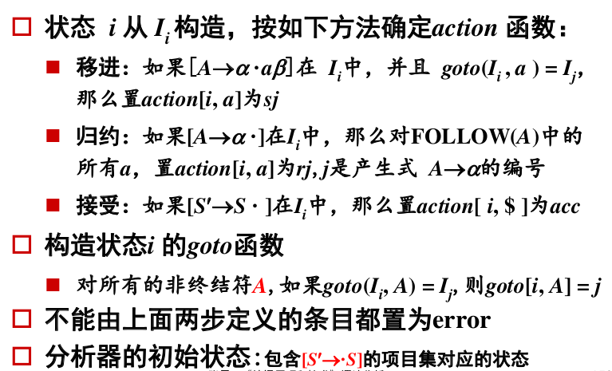
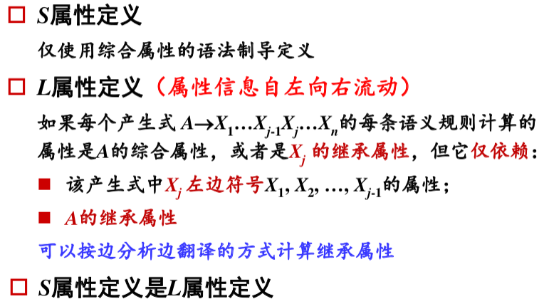
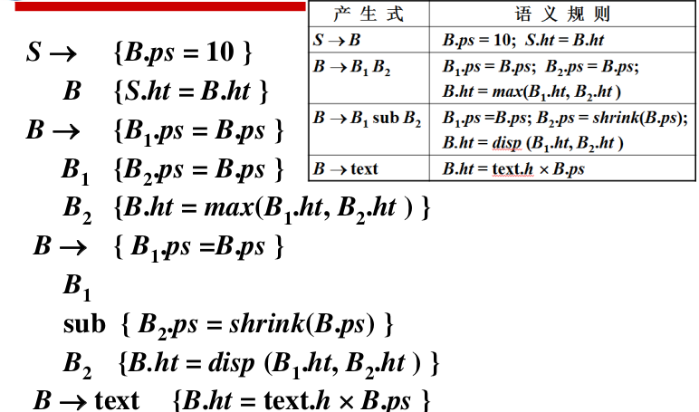

# Part 1. PPT

## 一、词法分析

### 1.


### 2. 正规式到简化的DFA

> 正规式- -> NFA --> DFA --> 化简的DFA

#### 正规式-->NFA

>  语法制导算法


#### NFA --> DFA

>  子集构造法


#### DFA 化简

当转换函数由部分函数改成全函数表示时引入死状态


可区别的状态 s 和 t : 分别从s 、 t出发,存在一个输入符号w,使得一个到达接受状态,另一个到达非接受状态。


- A 和 B 是可区别的状态:
  从A出发,读入 b 后到达非接受状态C;从B出发,读过 b 后到达接受状态D
- A 和 C 是不可区别的状态:
  无任何输入符号可用来区别它们

```C
1. 按是否是接受状态来区分
{A, B, C}, {D}
move({A, B, C}, a) = {B}
move({A, B, C}, b) = {C, D}
move({A, C}, b) = {C}
2. {A, C}, {B}, {D}
move({A, C}, a) = {B}
```


## 二、语法分析

### 1. 前述

#### (1) 正规式-->上下文无关文法


#### (2) 消除左递归


#### (3) 提左因子


#### (4) 写文法

##### 非二义文法

```
S --> S and S | S or S | not S | p | q | '('S')' 

E --> E or T | T
T --> T and F | F
F --> not F | '('E')' | p | q
```

##### 等价的不同文法


### 2. 自上而下分析

#### (1) First, Follow计算


#### (2) LL(1)文法

##### I. 要求


##### II. 非递归的预测分析

根据预测分析表p57

##### III. 预测分析表的构造

p58


##### IV. 预测分析的错误恢复


### 3. 自下而上分析

> 移进-归约分析

#### (1) 概念

##### 归约


 ##### 句柄


#### (2) 移进-归约分析

##### 栈实现

p65

##### 冲突

> 移进-归约：移进还是归约？
>
> 归约归约：选择哪一条来归约

#### (3) LR分析器

> - L-scanning from left to right; 
>
> - R-rightmost derivation in reverse

##### LR分析算法

p70

根据分析表


#### (4) SLR 分析表

##### LR(0)项目集规范族

p73 closure

p74 goto

##### 构造SLR分析表

p77



#### (5) 规范LR分析表

##### LR(1)项目集

p80

##### 构造规范LR分析表

p81


#### (6) LALR分析表

##### 构造LALR分析表

p84

### 4. 各种文法例题

A.


B.


## 三、语法制导翻译

### 1. 概念

简单计算器的语法制导定义　p107

注释分析树 p108

继承属性 p108

含继承属性的注释分析树 p109

属性依赖图 p109

### 2. 语法树及其构造

> 算符和关键字是语法树中的内部结点

#### (1) 语法制导定义

p112

图见下面/自下而上计算/S属性

#### (2) 语法树

p113


#### (3) 左递归的消除

引起了继承属性

翻译方案　p119

#### (4) 例子

A. 


B.


C.


### 3. 自上而下计算

#### (1) L属性，S属性



变量类型声明的语法制导定义　p116

图见自下而上计算/L属性/继承属性计算/case1 属性位置可预测

#### (2) 案例EQN语言

##### I. 语法制导定义

p117


##### II. 翻译方案

p118



##### III. 预测翻译器的设计

p121

#### (3) 非L属性

> 改写文法，用综合属性代替继承属性

p121

### 4. 自下而上计算

#### (1) S 属性

p114


#### (2) L属性

##### I. 删除翻译方案中嵌入的动作

p123


##### II. 继承属性的计算

###### case1 属性位置可预测

> 继承属性值已在分析栈中
>
> 略去继承属性的计算：引用继承属性的地方改成引用其他符号的综合属性

类型声明

p123


###### case2 属性位置不可预测

案例　p124


EQN p125


继承属性的值等于栈中某个综合属性的值,因此栈中只保存综合属性的值


# Part 2. 习题

