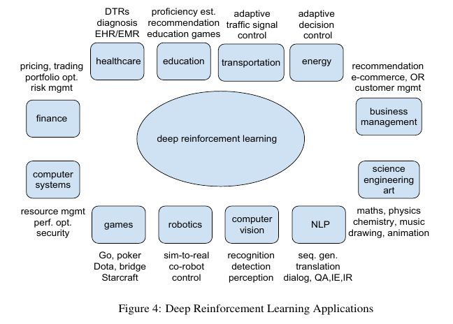

*主要介绍近期RL的应用状况*

## Overview

近期对强化学习的综述中比较优秀的文章有两篇，一是[Deep Reinforcement Learning](https://arxiv.org/abs/1810.06339), 二是[An Introduction to Deep Reinforcement Learning](https://arxiv.org/abs/1811.12560)其中前者对应用部分介绍比较详细，后者侧重算法概括。

## Games

 对AI算法来说，游戏是非常好的实验平台，在游戏中，有很棒甚至完美的模拟器，能够产生无限的数据。在电脑游戏中取得了许多人类级别甚至超过人类级别成绩的成就。

下面会介绍三个，也就是Board Games, Card Games和 Video Games, 分别代表完全信息零和，非完全信息零和以及只有部分观察量的以视频为输入的非完全信息。

### Board Games

棋盘游戏比如说，国际象棋，围棋，双陆棋。两个玩家都拥有完全的信息。在1994年就有科研人员利用神经网络近似value fucntion然后结合TD learning在双陆棋中达到了人类水平的成绩。

下面重点介绍围棋的Alpha系列。

解决围棋问题的难度不仅仅在于庞大的搜索空间（$250^{150}$）也在于position evaluation的困难，而后者在其他的棋类中得到了成功的应用，比如国际象棋、双陆棋。

**[AlphaGo](https://deepmind.com/research/alphago/)**

AlphaGo主要利用的技术是CNN, 监督学习，强化学习，Monto Carlo树搜索(MCTS)。包含两个阶段：神经网络训练管道和MCTS. 其中训练管道包括一个从专家下法数据训练得到的监督学习policy网络，一个快速rollout policy, 一个RL policy网络，和一个RL value网络。

监督学习policy网络包括卷积层，ReLU非线性单元，以及softmax的输出代表有效move的概率分布。输入到CNN的是$19\times 19\times 48$的图像栈，其中19是围棋棋盘的维度，48是特征的数量。

从专家move中采样state-action对来训练网络，利用随机梯度上升来最大化在给定state的move选择的似然概率。而快速rollout使用线性的softmax以及少的特征来达到快速部署的效果。

而RL policy网络提升了上面网络的性能，它使用与上面网络同样的网络结构，并且用刚刚训练得到的权重作为初始值，然后使用policy gradient来训练。reward的设置为，在终结状态，+1表示赢，-1表示输，其他的所有reward都是0. 为了稳定训练过程以及避免过拟合，在当前的policy和一个随机的之前的policy网络之间博弈。权重使用随机梯度上升最大化期望输出来更新。

RL value网络，依然与上面的网络有同样的结构，不同的是，输出只有一个值来预测某个位置的value值。value网络使用Monte Carlo policy evaluation方法来学习。为了解决由于在连续的位置的强相关性导致的过拟合问题，采用的数据是从自对弈产生的。然后使用随机梯度上升来减小预测值和相应的结果值之间的均方差来更新权重。

在MCTC阶段，AlphaGo使用一个向前看的搜索来选择moves. 它会建立一个从当前状态出发的部分的树，包括以下阶段，1. 选择一个比较有前景的节点，然后继续探索。2. 使用监督学习得到的网络来扩展一个叶节点，然后收集数据。3. 使用RL value网络和rollout policy来评估一个叶节点。4. 使用backup evaluations来更新action值。 从而一个move就产生了。

**[AlphaGo Zero](https://deepmind.com/blog/alphago-zero-learning-scratch/)**

与AlphaGo相比的区别是：1. zero是从随机下棋结合子学习来训练的，不需要人类的数据或者或者监督。2. zero使用黑白棋子作为输入，无需任何人工的特征工程。3. 它使用一个神经网络来代表policy和value而不是将他们分开。

使用了64个GPU workers和19个CPU papameter servers用于训练，大概2000个TPU用于数据生成，4个TPU用于对弈。计算消耗很大。另外ELF OpenGo是使用ELF的对AlphaGo Zero/Alpha Zero的重新实现。

**Alpha Zero**

这是将上面的AlphaGo Zero更加通用化到其他的领域（两个玩家的完全信息零和博弈），使用一个通用的RL算法，不使用人类的只是（除了游戏规则）。在国际象棋、将棋和围棋领域中已经取得了超过人类的成绩。

### Card Games

包括Texas Hold'em Poker, majiang.mahjong, Skat等等，是属于非完全信息博弈。近期的成就是DeepStack, 首次打败了专业的poker玩家。

### Video Games

也就是使用视频帧作为输入，主要包括Atari 2600 games. 算法包括DQN及其扩展。

## Robotics

Robotics给RL提出了一系列挑战，包括维度问题，显示世界的案例，不能获得全部信息的模型，模型不确定性，reward和goal的确定，等等。

### Sim-to-Real

意思是使用模拟来代替现实，具体的意义比如说在现实中的exploration可能会导致很风险的结果。

比如说OpenAI, MuJoCo都提供了相应的模拟环境。

### Autonomous Driving Vehicles

文中仅仅列举了诸多的相关链接，并且指出当前的自动驾驶车辆并没有完全测试成功。

## Computer Vision

### Recognition 

RL能够通过聚焦在显著的部分来提高图片分类的效率。对于目标定位和识别，RL能够减小定位的搜索空间来提高效率。

### Motion Analysis

也就是跟踪一个运动的目标。

其他的Scene Understanding/Visual Control/Interactive Perception仅列举了相关的工作。

## Ref

- [Deep Reinforcement Learning](https://arxiv.org/abs/1810.06339)
- [An Introduction to Deep Reinforcement Learning](https://arxiv.org/abs/1811.12560)