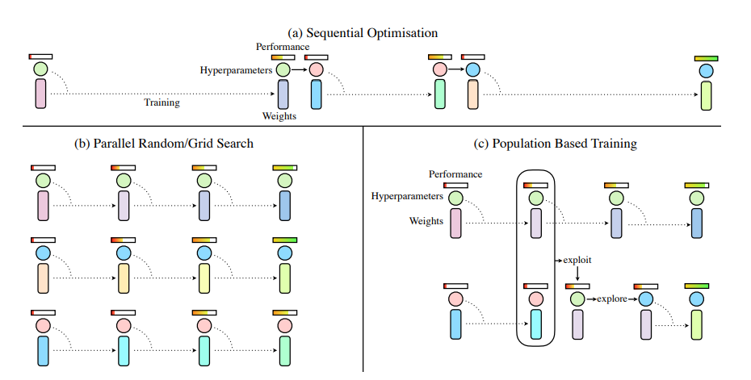
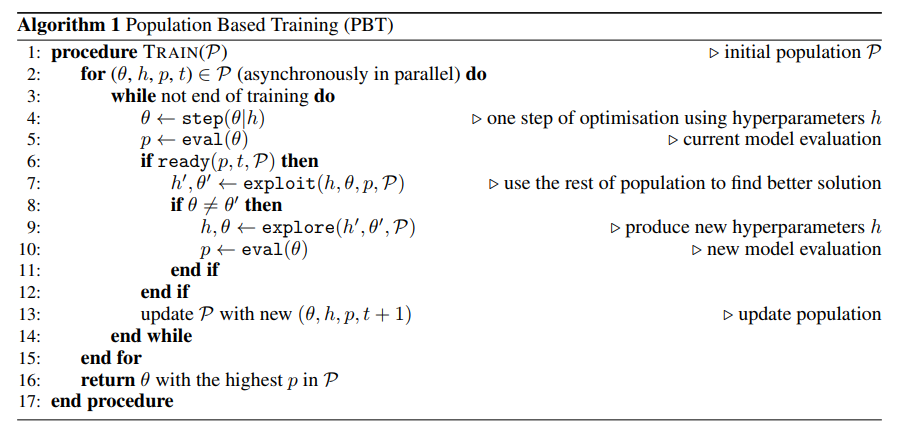
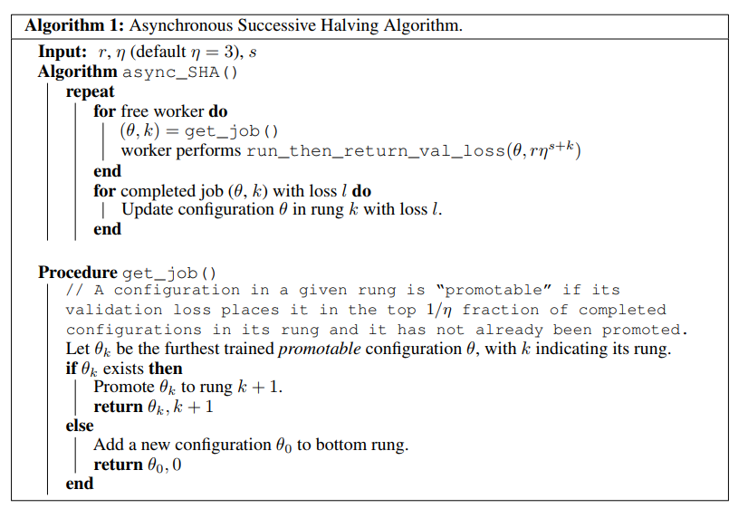
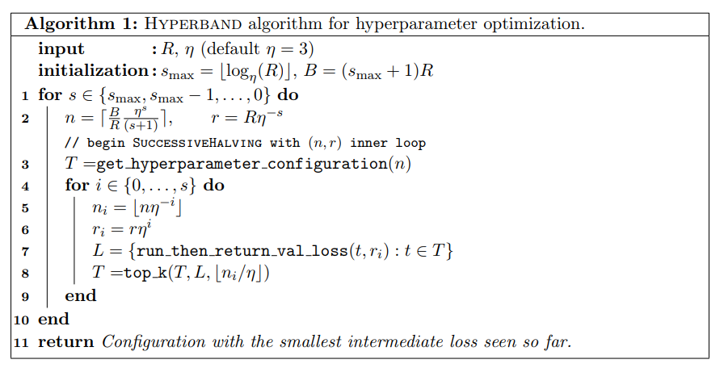
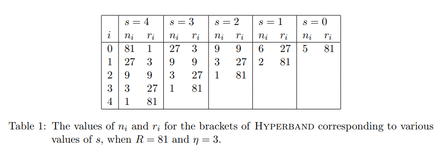
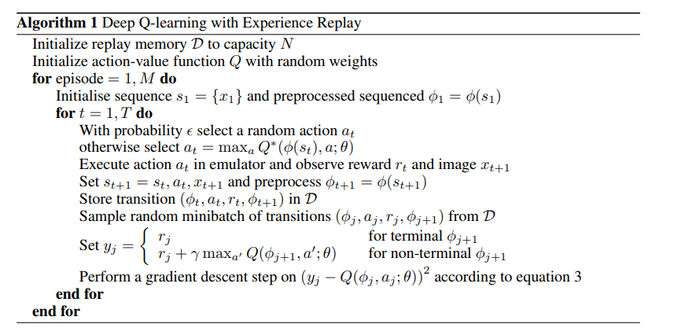

*讨论在整个ray系列中出现的算法*

## Tune

注意Trial Schedulers与Search Algorithms是不同的。前者安排一系列Trials如何执行执行顺序，后者确定每次的Hyperparameter Configuration.

### 1. Tune Trial Schedulers

#### 1.1. Popilation Based Training (PBT)

[DeepMind Blog-PBT](https://deepmind.com/blog/population-based-training-neural-networks/)

[Population Based Training of Neural Networks](https://arxiv.org/abs/1711.09846)

本论文首先介绍当前的hyperparameter调整的方式分为如下

- Paralle Search

  并行多个进程，每个进程不同的hyperparameter. 最后将结果比较，选择最好的那个

  - Grid Search
  - Random Search

- Sequential Optimisation

  每次运行一个，然后根据这个的结果，重新选择hyperparameter, 循环往复，直到比较好的结果

用流程图来表示就是：



而PBT就是，并行一系列hyperparameter不同的模型，然后在中间将那些结果不好的模型的parameter和hyperparameter换成较好的那个(exploit), 并且加上一些随机的噪声(explore).



#### 1.2. Asynchronous HyperBand

[Massively Parallel Hyperparameter Tuning](https://openreview.net/forum?id=S1Y7OOlRZ)

这个算法是下面的HyperBand异步推广的结果。它的算法为



论文中只给出了Successive Halving算法(SHA),　由于下面的HyperBand 使用了SHA的子过程，所以很容易补充成为Asynchronous HyperBand.

输入的参数为$r$ 最小资源，$\eta >0$ 表示reduction factor, $s$ 表示最小的early-stop rate.

注意到rung越大，表示这个超参的设定越有前景，则分配到的资源越大。

同时由于get_job()函数的存在，使得算法是异步的，当发现存在promotable设定的时候，就返回这个设定，并且将rung加一，如果不存在，也不用等待其他的结束，而是直接生成一个新的设定，且rung=0

#### 1.3. HyperBand

[standard version of HyperBand](https://arxiv.org/abs/1603.06560)

https://people.eecs.berkeley.edu/~kjamieson/hyperband.html

这个的实际目标是，资源B是有限的，尝试的次数n可以选择，每次尝试分配的资源是B/n, 那么如何分配资源，n可大可小。

提出的算法如下



设定一个案例如下：



将trial分成很多部分，每次trial最大资源为$R$, 分成$(s_{max}=\lfloor \log _{\eta} (R) \rfloor)+1$ 个阶段，每个阶段总资源为$B=(s_{max}+1)R$ 每个阶段又分成多个子部分，其中当尝试的个数$n_i$越大，分配的资源$r_i$越小，越会提早结束探索。每个SHA子过程都使用不同的early-stop rate.(由于现代的超参调试问题都有高维的搜索空间，并且模型有很大的训练代价，所以提前终止是很有必要的)

其中get_hyperparameter_configuration(n) 表示从超参的设定集合中采样n个独立同分布的样本。

run_then_return_val_loss(t,ri)表示超参为t, 资源为ri时的validation loss

python 代码如下

```python
# you need to write the following hooks for your custom problem
from problem import get_random_hyperparameter_configuration,run_then_return_val_loss

max_iter = 81  # maximum iterations/epochs per configuration
eta = 3 # defines downsampling rate (default=3)
logeta = lambda x: log(x)/log(eta)
s_max = int(logeta(max_iter))  # number of unique executions of Successive Halving (minus one)
B = (s_max+1)*max_iter  # total number of iterations (without reuse) per execution of Succesive Halving (n,r)

#### Begin Finite Horizon Hyperband outlerloop. Repeat indefinetely.
for s in reversed(range(s_max+1)):
    n = int(ceil(int(B/max_iter/(s+1))*eta**s)) # initial number of configurations
    r = max_iter*eta**(-s) # initial number of iterations to run configurations for

    #### Begin Finite Horizon Successive Halving with (n,r)
    T = [ get_random_hyperparameter_configuration() for i in range(n) ] 
    for i in range(s+1):
        # Run each of the n_i configs for r_i iterations and keep best n_i/eta
        n_i = n*eta**(-i)
        r_i = r*eta**(i)
        val_losses = [ run_then_return_val_loss(num_iters=r_i,hyperparameters=t) for t in T ]
        T = [ T[i] for i in argsort(val_losses)[0:int( n_i/eta )] ]
    #### End Finite Horizon Successive Halving with (n,r)
```

#### 1.4. Median Stopping Rule

[Google Vizier: A Service for Black-Box Optimization](https://ai.google/research/pubs/pub46180)

这篇文章介绍的是google研发的Black0Box Optimization系统。主要介绍了系统的组成。略。

### 2. Tune Search Algorithms

#### 2.1. Variant Generation (Grid Search/Random Search)

不必过多介绍。

#### 2.2. HyperOpt Search (Tree-structured Parzen Estimators)

[Hyperopt Distributed Asynchronous Hyperparameter Optimization in Python](http://hyperopt.github.io/hyperopt/)

这其实是一个Python库：

> `hyperopt` is a Python library for optimizing over awkward search spaces with real-valued, discrete, and conditional dimensions.

目前实现的算法有

- Random Search
- Tree of Parzen Estimators (TPE)

使用案例

安装`pip install hyperopt`

```python
from hyperopt import hp

# define an objective function
def objective(args):
    case, val = args
    if case == 'case 1':
        return val
    else:
        return val ** 2

# define a search space
from hyperopt import hp
space = hp.choice('a',
    [
        ('case 1', 1 + hp.lognormal('c1', 0, 1)),
        ('case 2', hp.uniform('c2', -10, 10))
    ])

# minimize the objective over the space
from hyperopt import fmin, tpe, space_eval
best = fmin(objective, space, algo=tpe.suggest, max_evals=100)

print(best)
print(space_eval(space,best))
```

输出为

```python
{'a': 1, 'c2': -0.08088083656564893}
('case 2', -0.08088083656564893)
```

注意到用法其实很简单，定义objective, 设定search space, 选择search aalgorithms, 设定evaluations数目。

ray里面其实是调用这个库来实现的。

## RLlib

### 1. RLlib Algorithms

#### 1.1. High-throughput architectures

##### 1.1.1. Distributed Prioritized Experience Replay (Ape-X)

[Distributed Prioritized Experience Replay](https://arxiv.org/abs/1803.00933)

是DQN与DDPG关于Apx-X的变体。使用一个GPU learner与多个CPU workers, 用于experience collection.

> Experience collection can scale to hundreds of CPU workers due to the distributed prioritization of experience prior to storage in replay buffers

***TODO***

##### 1.1.2. Importance Weighted Actor-Learner Architecture (IMPALA)

[IMPALA: Scalable Distributed Deep-RL with Importance Weighted Actor-Learner Architectures](https://arxiv.org/abs/1802.01561)

在IMPALA中，一个中心的learner在一个很紧凑的循环里执行SGD, 同时异步地从许多actor processes里面拉取样本batches

***TODO***

#### 1.2. Gradient-based

##### 1.2.1. Advantage Actor-Critic (A2C, A3C)

[Asynchronous Methods for Deep Reinforcement Learning](https://arxiv.org/abs/1602.01783)

***TODO***

##### 1.2.2. Deep Deterministic Policy Gradients (DDPG, TD3)

[Continuous control with deep reinforcement learning](https://arxiv.org/abs/1509.02971)

DDPG实现与DQN实现很像。

***TODO***

##### 1.2.3. Deep Q Networks (DQN, Rainbow, Parametric DQN)

[Playing Atari with Deep Reinforcement Learning](https://arxiv.org/abs/1312.5602)

[Rainbow: Combining Improvements in Deep Reinforcement Learning](https://arxiv.org/abs/1710.02298)

**DQN**

DQN是第一个使用DL直接从高维数据中学习control policy作为RL输入的成功的模型。

该论文中提到了DL应用于RL面临的困境：

- 大部分成功的DL应用都需要大量标注了的数据。另一方面，RL必须要从标量reward中学习，而这种reward通常是稀疏的、充满噪声的、延迟的。
- 大部分DL要求采样的数据必须是独立的。但是RL通常是连续的高度相关的状态。
- DL通常假设数据的分布是固定的，但是RL的数据分布却通常随着behaviours的不同而不同

本论文为了解决数据相关问题以及不稳定的分布问题，使用了Experience Replay机制，也就是每次的转移都存起来，训练的时候随机从存储里面抽取。

文章使用了Q Learning, 所以介绍了Q Learning

$Bellman\ equation$
$$
Q^*(s,a)=\mathbb{E}_{s' \sim \mathcal{E}}\Big[r+\gamma \max_{a'}Q^*(s',a')\Big|s,a\Big]
$$
可以使用$value\ iteration$来收敛到该optimal action-value funtion
$$
Q_{i+1}(s,a)=\mathbb{E}\Big[{r+\gamma\max_{a'}} Q_{i}(s',a')\Big|s,a\Big]
$$
$Q_i \to Q^*\ \text{as}\ i\to \infty $. 但是实际上这种方式是完全不可行的，因为对于每个sequence, action-value函数的估计是分开的，这样就失去了generalisation. 所以通常会使用function approximator来估计action-value 函数，即$Q(s,a;\theta)\approx Q^*(s,a)$. 通常会使用linear function, 偶尔使用non-linear函数近似，比如NN. 

这篇论文中使用的他们称为Q-network, 可以通过如下的loss function来优化($L_i(\theta_i)$表示每个循环i都会改变)
$$
L_i(\theta_i)=\mathbb{E}_{s,a\sim \rho(\cdot)}\Big[(y_i-Q(s,a;\theta_i))^2 \Big]
$$
其中$y_i$为target value.它会随着循环而改变，这不同于监督学习。
$$
y_i=\mathbb{E}_{s'\sim \mathcal{E}}\Big[r+\gamma\max_{a'}Q(s',a';\theta_{i-1}\Big|s,a\Big]
$$
$\rho$表示behaviour distribution.

Loss function的微分为
$$
\nabla_{\theta_i}L_i(\theta_i)=\mathbb{E}_{s,a\sim\rho(\cdot);s'\sim\mathcal{E}}
\Big[\Big(r+\gamma\max_{a'}Q(s',a';\theta_{i-1})-Q(s,a;\theta_i)\nabla_{\theta_i}Q(s,a;\theta_i)	 \Big)
\Big]
$$
注意上述算法有如下的特点

- model-free: 并没有构建关于estimator $\mathcal{E}$的模型
- off-policy: 学习的是greedy strategy $a=\max_{a}Q(s,a;\theta)$, 但是使用的behavior通常是$\epsilon$-greedy的

接下来就是详细介绍了DQN算法



需要注意的是，由于原始的像素数据太大，并不适合作为模型输入，所以添加了一个$\Phi$函数来预处理image

**Rainbow**

在DQN提出来之后，有许多的论文提出了改进意见，这篇文章是抽取6种改进，然后将它们组合进行评测。使用的extensions 如下:

1. Double Q-Learning

   首先注意到DQN是在减小如下loss
   $$
   (R_{t+1}+\gamma_{t+1}\max_{a'}q_{\bar{\theta}}(S_{t+1},a')-q_{\theta}(S_t,A_t))^2
   $$
   注意到其中的max部分，选择action使用的是target value, 对选用的action来评估也是使用target value, 这样有可能过高地估计某个action的效力，导致整个q都偏高。改进方式就是使用不同的value. 考虑到计算量，DDQN使用的是，$q_\theta$来选择action, 由$q_{\bar{\theta}}$来评估。式子如下：
   $$
   (R_{t+1}+\gamma_{t+1}q_{\bar{\theta}}(S_{t+1},\arg \max_{a'}q_{\theta}(S_{t+1},a'))-q_{\theta}(S_t,A_t))^2
   $$

2. Prioritized replay

   DQN从replay buffer中取样是均匀的，但是有一些数据更加有价值，应该更多地去学。所以该方法使用了某种概率$p_t$来选择，该概率与last encountered absolute TD error:
   $$
   p_t \propto \Big| R_{t+1}+\gamma_{t+1}\max_{a'}q_{\bar{\theta}}(S_{t+1},a')-q_{\theta}(S_t,A_t) \Big|^{\omega}
   $$
   其中$\omega$是决定分布形状的参数。新加进来的数据会有最大的可能性。

3. Dueling Network

   ***TODO***

4. Multi-step Learning

   注意DQN使用了第一个reward然后后面就是估计值，其实还可以使用多个
   $$
   R_t^{(n)}=\sum_{k=0}^{n-1}\gamma_{t}^{(k)}R_{t+k+1}\\
   $$
   相应的，loss改为
   $$
   (R_t^{(n)}+\gamma_t^{(n)}\max_{a'}q_{\bar{\theta}}(S_{t+n},a')-q_\theta(S_t,A_t))^2
   $$

5. Distributional RL

   ***TODO***

6. Noisy Nets

   ***TODO***

这里面好几个我自己没有接触过，更加详细的说明留在以后。

##### 1.2.4. Policy Gradients

[Policy Gradient Methods for Reinforcement Learning with Function Approximation ](https://papers.nips.cc/paper/1713-policy-gradient-methods-for-reinforcement-learning-with-function-approximation.pdf)

vabilla policy gradients.下面的PPO表现更好

***TODO***

#####  1.2.5. Proximal Policy Optimization (PPO)

[Proximal Policy Optimization Algorithms](https://arxiv.org/abs/1707.06347)

***TODO***

#### 1.3. Derivative-free

##### 1.3.1. Augmented Random Search (ARS)

[Simple random search provides a competitive approach to reinforcement learning](https://arxiv.org/abs/1803.07055)

***TODO***

##### 1.3.2. Evolution Strategies

[Evolution Strategies as a Scalable Alternative to Reinforcement Learning](https://arxiv.org/abs/1703.03864)

***TODO***