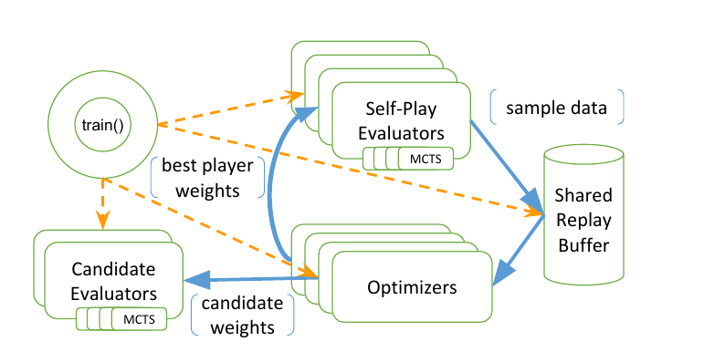

*继续深入RLlib的代码部分*

**PLAN**

- [ ] 结合[RLlib文档](https://ray.readthedocs.io/en/latest/rllib.html) 阅读[RLlib代码](https://github.com/ray-project/ray/tree/master/python/ray/rllib)

- [ ] 学习了解最新的RL算法：[CS 294-112 at UC Berkeley](http://rail.eecs.berkeley.edu/deeprlcourse/)

  > 已完成**13/22**

  **其他资源**

  - [Sutton & Barto, Reinforcement Learning: An Introduction](http://incompleteideas.net/book/the-book-2nd.html)

    仅仅到了Policy Gradient 略陈旧

  - [Deep Reinforcement Learning](https://arxiv.org/abs/1810.06339)

    比较完善和新的一篇综述

  - [Resources for Deep Reinforcement Learning](https://medium.com/@yuxili/resources-for-deep-reinforcement-learning-a5fdf2dc730f)

    目前比较齐全和权威的资源合集

  - [OpenAI Spinningup](https://spinningup.openai.com/en/latest/)

    超级良心RL教程

.
├── agents
│   ├── a3c
│   │   ├── a2c.py #Advantage Actor-Critic
│   │   ├── a3c.py #
│   │   ├── a3c_tf_policy_graph.py
│   │   ├── a3c_torch_policy_graph.py
│   │   └── __init__.py
│   ├── agent.py 关于算法的COMMON_CONFIG, 可以自行设定
│   ├── ars
│   │   ├── ars.py #ARS Augmented Random Search
│   │   ├── __init__.py
│   │   ├── optimizers.py
│   │   ├── policies.py
│   │   └── utils.py
│   ├── ddpg
│   │   ├── apex.py #APX_DDPG
│   │   ├── common
│   │   │   └── __init__.py
│   │   ├── ddpg_policy_graph.py
│   │   ├── ddpg.py #DDPG Deep Deterministic Policy Gradients
│   │   ├── __init__.py
│   │   └── README.md
│   ├── dqn
│   │   ├── apex.py #APX_DQN
│   │   ├── common
│   │   │   └── __init__.py
│   │   ├── dqn_policy_graph.py
│   │   ├── dqn.py #DQN Deep Q Networks
│   │   ├── __init__.py
│   │   └── README.md
│   ├── es
│   │   ├── es.py #ES Evolution Strategy
│   │   ├── __init__.py
│   │   ├── optimizers.py
│   │   ├── policies.py
│   │   └── utils.py
│   ├── impala
│   │   ├── impala.py #IMAALA Importance Weighted Actor-Learner Architecture
│   │   ├── __init__.py
│   │   ├── vtrace_policy_graph.py
│   │   └── vtrace.py
│   ├── __init__.py
│   ├── mock.py
│   ├── pg
│   │   ├── __init__.py
│   │   ├── pg_policy_graph.py #基于PG的policy graph
│   │   └── pg.py #PG Policy Gradient
│   └── ppo
│       ├── __init__.py
│       ├── ppo_policy_graph.py
│       ├── ppo.py #PPO Proximal Policy Optimization
│       ├── rollout.py
│       ├── test
│       │   └── test.py
│       └── utils.py
├── asv.conf.json
├── env
│   ├── async_vector_env.py #Async
│   ├── atari_wrappers.py
│   ├── env_context.py
│   ├── external_env.py #external Agents
│   ├── __init__.py
│   ├── multi_agent_env.py #Multi-Agent
│   ├── serving_env.py
│   └── vector_env.py #Vector
├── evaluation
│   ├── episode.py
│   ├── __init__.py
│   ├── interface.py
│   ├── keras_policy_graph.py
│   ├── metrics.py
│   ├── policy_evaluator.py #使用policy与环境交互
│   ├── policy_graph.py #policy graph超类
│   ├── postprocessing.py
│   ├── sample_batch.py
│   ├── sampler.py
│   ├── tf_policy_graph.py #tensorflow policy graph template
│   └── torch_policy_graph.py #pytorch policy graph template
├── examples
│   ├── carla
│   │   ├── a3c_lane_keep.py
│   │   ├── dqn_lane_keep.py
│   │   ├── env.py #用于Carla的gym env, demo
│   │   ├── models.py #自定义model 案例
│   │   ├── ppo_lane_keep.py
│   │   ├── README
│   │   ├── scenarios.py
│   │   ├── train_a3c.py
│   │   ├── train_dqn.py
│   │   └── train_ppo.py
│   ├── cartpole_lstm.py
│   ├── custom_env.py # 作为自定义gym env的demo
│   ├── custom_metrics_and_callbacks.py
│   ├── __init__.py
│   ├── multiagent_cartpole.py #multiagent的carpole，同时也有不同policy的参数共享
│   ├── multiagent_two_trainers.py #同时使用两个训练算法
│   └── serving
│       ├── cartpole_client.py　#client
│       ├── cartpole_server.py  	#server
│       └── test.sh
├── __init__.py
├── models
│   ├── action_dist.py
│   ├── catalog.py #配置model MODEL_DEFAULTS
│   ├── fcnet.py #fully connected network
│   ├── __init__.py
│   ├── lstm.py #LSTM
│   ├── misc.py
│   ├── model.py #自定义model的超类
│   ├── preprocessors.py #自定义preprocessors的超类
│   ├── pytorch
│   │   ├── fcnet.py
│   │   ├── __init__.py
│   │   ├── misc.py
│   │   ├── model.py
│   │   └── visionnet.py
│   ├── README.txt
│   └── visionnet.py #vision network for image observations
├── optimizers
│   ├── async_gradients_optimizer.py　#异步计算gradients
│   ├── async_replay_optimizer.py
│   ├── async_samples_optimizer.py #异步sample
│   ├── __init__.py
│   ├── multi_gpu_impl.py
│   ├── multi_gpu_optimizer.py
│   ├── policy_optimizer.py
│   ├── replay_buffer.py
│   ├── segment_tree.py
│   ├── sync_replay_optimizer.py
│   ├── sync_samples_optimizer.py
│   └── tests
│       └── test_segment_tree.py
├── README.md
├── rollout.py 有关于checkpoint恢复的代码
├── scripts.py
├── test
│   ├── __init__.py
│   ├── mock_evaluator.py
│   ├── test_catalog.py
│   ├── test_checkpoint_restore.py
│   ├── test_env_with_subprocess.py
│   ├── test_evaluators.py
│   ├── test_external_env.py
│   ├── test_filters.py
│   ├── test_local.py
│   ├── test_lstm.py
│   ├── test_multi_agent_env.py
│   ├── test_nested_spaces.py
│   ├── test_optimizers.py
│   ├── test_policy_evaluator.py
│   ├── test_rollout.sh
│   └── test_supported_spaces.py
├── train.py
├── tuned_examples 一些很好用的超参设定
│   ├── atari-a2c.yaml
│   ├── atari-apex.yaml
│   ├── atari-dist-dqn.yaml
│   ├── atari-dqn.yaml
│   ├── atari-duel-ddqn.yaml
│   ├── atari-impala.yaml
│   ├── atari-ppo.yaml
│   ├── cartpole-grid-search-example.yaml
│   ├── generate_regression_tests.py
│   ├── halfcheetah-ddpg.yaml
│   ├── hopper-ppo.yaml
│   ├── humanoid-es.yaml
│   ├── humanoid-ppo-gae.yaml
│   ├── humanoid-ppo.yaml
│   ├── hyperband-cartpole.yaml
│   ├── mountaincarcontinuous-apex-ddpg.yaml
│   ├── mountaincarcontinuous-ddpg.yaml
│   ├── pendulum-apex-ddpg.yaml
│   ├── pendulum-ddpg.yaml
│   ├── pendulum-ppo.yaml
│   ├── pong-a3c-pytorch.yaml
│   ├── pong-a3c.yaml
│   ├── pong-apex.yaml
│   ├── pong-dqn.yaml
│   ├── pong-impala-vectorized.yaml
│   ├── pong-impala.yaml
│   ├── pong-ppo.yaml
│   ├── pong-rainbow.yaml
│   ├── regression_tests
│   │   ├── cartpole-a3c-pytorch.yaml
│   │   ├── cartpole-a3c.yaml
│   │   ├── cartpole-ars.yaml
│   │   ├── cartpole-dqn.yaml
│   │   ├── cartpole-es.yaml
│   │   ├── cartpole-pg.yaml
│   │   ├── cartpole-ppo.yaml
│   │   ├── __init__.py
│   │   ├── pendulum-ddpg.yaml
│   │   ├── pendulum-ppo.yaml
│   │   └── regression_test.py
│   ├── run_regression_tests.py
│   ├── swimmer-ars.yaml
│   └── walker2d-ppo.yaml
└── utils
​    ├── actors.py
​    ├── compression.py
​    ├── error.py
​    ├── explained_variance.py
​    ├── filter_manager.py
​    ├── filter.py
​    ├── __init__.py
​    ├── policy_client.py
​    ├── policy_server.py
​    ├── schedules.py
​    ├── seed.py
​    ├── tf_run_builder.py
​    ├── timer.py
​    └── window_stat.py

### AlphaGoZero 案例

